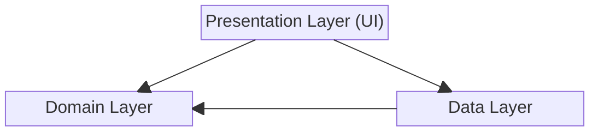

# One Piece Android Application
Modern Android development showcase with Clean Architecture and Jetpack Compose

## 📱 About
This repository is an intentionally small-scoped demo — its purpose is to showcase how to structure Android features cleanly: Clean Architecture, MVVM, unidirectional data flow, Jetpack Compose, Coroutines/Flow, and Hilt for dependency injection.

**Scope note**: In production apps with hundreds of modules, build performance becomes a first-class concern. For those contexts, I apply dedicated Gradle caching strategies (local + remote build cache, configuration cache, parallel execution, fine-grained api/implementation splits) to keep CI and local build times manageable. That layer of complexity is intentionally absent here — keeping the focus on architecture patterns, not build engineering.

## ✨ Features
- Browse a list of One Piece characters and Devil Fruits fetched from the One Piece API.
- Local caching for offline access and faster reloads.
- Save and manage a personal list of favorite characters.
- Character and Devil Fruit details.

## 🛠 Tech Stack

**Architecture & Patterns**
- Clean Architecture (Domain/Data/Presentation layers)
- MVVM/MVI with Repository pattern + UI State
- Dependency Injection (Hilt/Dagger)

**UI & UX**
- Jetpack Compose
- Material Design 3
- Navigation Component

**Concurrency & Networking**
- Kotlin Coroutines & Flow
- Retrofit & OkHttp
- Room Database & DataStore

**Testing**
- JUnit4, JUnit5, MockK
- Robolectric
- Espresso
- ScreenshotTest
  
**Code Coverage by Jacoco**

The project maintains a **75%** code coverage goal, reflecting Google’s best-practice range for well-tested software.
Rather than maximizing the percentage, our testing strategy emphasizes reliability, maintainability, and meaningful coverage of essential logic.
This approach ensures we maintain strong test confidence without introducing unnecessary overhead.

[Code coverage report on CodeCov](https://app.codecov.io/github/anhtuanmai/one-piece)

**CI/CD**
- GitHub Actions & Bitrise
- Automated testing & builds

## 🏗 Clean Architecture

Please read [**The Clean Code Blog** by Robert C. Martin (Uncle Bob)](https://blog.cleancoder.com/uncle-bob/2012/08/13/the-clean-architecture.html)

